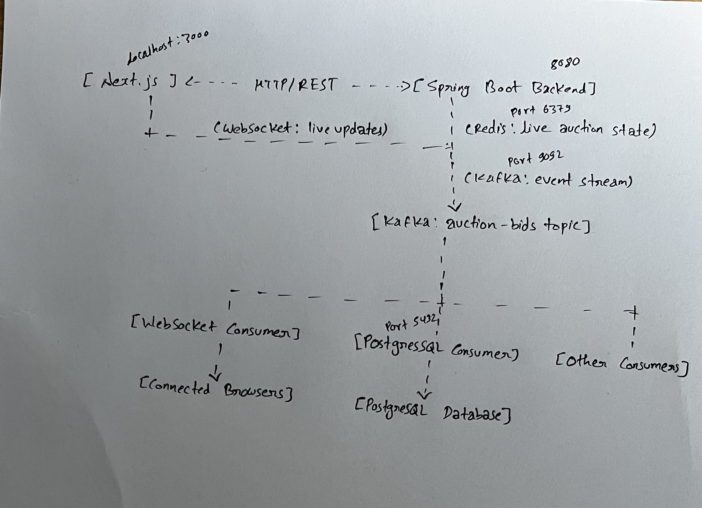

# Live Auction System

Real-time online auction platform built with Spring Boot, Redis, Apache Kafka, WebSocket, PostgreSQL, and Next.js.

Users can place bids on active auctions and see live updates—current price, highest bidder, and bid history—instantly in the browser without refreshing the page.

## Features

- 🚀 Real-time bidding with sub-second updates
- 🔐 Atomic bid validation using Redis to prevent race conditions
- 📡 Event-driven architecture with Kafka
- 🌐 WebSocket-based live updates to connected clients
- 💾 Persistent storage with PostgreSQL
- 🎨 Modern React frontend with Next.js and TypeScript
- 🐳 Containerized infrastructure with Docker

## Architecture



## Event Flow

1. A client places a bid through an HTTP `POST` request.
2. The Spring Boot backend validates the bid and atomically updates live auction state in Redis.
3. The backend publishes a `BidAcceptedEvent` to Kafka.
4. A WebSocket consumer receives the Kafka event and broadcasts it to connected browsers.
5. A PostgreSQL consumer persists the accepted bid asynchronously.

```text
HTTP bid
  → Redis atomic update
  → Kafka BidAcceptedEvent
  → WebSocket broadcast
  → Browsers receive the live update

  → PostgreSQL consumer persists the bid
```

## Tech Stack

| Component | Technology |
|---|---|
| Backend | Java 17+, Spring Boot 3.x |
| Frontend | Next.js, React, TypeScript |
| Real-time communication | WebSocket, STOMP over SockJS |
| Live auction state | Redis (Docker) |
| Event bus | Apache Kafka (Docker) |
| Database | PostgreSQL (Docker) |
| Build tools | Maven, npm/yarn |
| Containerization | Docker and Docker Compose |

## Quick Start

### Prerequisites

- Java 17+
- Node.js 18+
- Docker and Docker Compose

### 1. Start infrastructure

From the repository root, start the required Docker services:

```bash
docker compose up -d
```

This starts:

- Redis on `localhost:6379`
- Kafka on `localhost:9092`
- PostgreSQL on `localhost:5432`

### 2. Run the backend

```bash
cd bidding-engine
mvn spring-boot:run
```

The backend runs at `http://localhost:8080`.

### 3. Run the frontend

Open another terminal:

```bash
cd bidding-frontend
npm install
npm run dev
```

The frontend runs at `http://localhost:3000`.

### 4. Test live bidding

1. Open `http://localhost:3000` in two browser tabs.
2. Navigate to an active auction.
3. Place a bid in one tab.
4. Verify that both tabs update instantly without a page refresh.

## Project Structure

```text
.
├── bidding-engine/              # Spring Boot backend
│   ├── src/main/java/
│   ├── src/main/resources/
│   └── pom.xml
├── bidding-frontend/            # Next.js frontend
│   ├── src/
│   ├── public/
│   └── package.json
├── architecture.jpg             # System architecture diagram
├── Live Auction Bidding.pdf     # Full project documentation
└── README.md
```

## API Endpoints

| Method | Endpoint | Description |
|---|---|---|
| GET | `/api/auctions` | List all auctions |
| GET | `/api/auctions/{id}` | Get one auction's details |
| POST | `/api/auctions/{id}/bids` | Place a bid |
| WebSocket | `/ws` | WebSocket connection endpoint |

WebSocket topic:

```text
/topic/auctions/{auctionId}
```

## Configuration

Edit:

```text
bidding-engine/src/main/resources/application.properties
```

If your project uses **`application.properties`**, use this format:

```properties
spring.data.redis.host=localhost
spring.data.redis.port=6379

spring.kafka.bootstrap-servers=localhost:9092

spring.datasource.url=jdbc:postgresql://localhost:5432/auctiondb
spring.datasource.username=postgres
spring.datasource.password=postgres
```

> Do not paste YAML syntax into `application.properties`. YAML works only when the file is named `application.yml` or `application.yaml`.

## Common Issues

| Issue | Solution |
|---|---|
| Redis connection refused | Ensure Redis is running with `docker ps`. |
| Kafka consumer receives no events | Check that Kafka is running, the topic exists, and event serialization is configured. |
| WebSocket cannot connect | Verify the `/ws` endpoint and allowed frontend origin. |
| CORS error in the browser | Allow `http://localhost:3000` in your Spring CORS configuration. |
| PostgreSQL connection error | Check the database container, port, database name, username, and password. |

## Documentation

The repository includes a detailed beginner-friendly explanation of the project in:

```text
Live Auction Bidding.pdf
```

## Contributing

1. Fork the repository.
2. Create a feature branch:

   ```bash
   git checkout -b feature/amazing-feature
   ```

3. Commit your changes:

   ```bash
   git commit -m "Add amazing feature"
   ```

4. Push the branch:

   ```bash
   git push origin feature/amazing-feature
   ```

5. Open a pull request.


Feel free to use this project for learning and experimentation.
